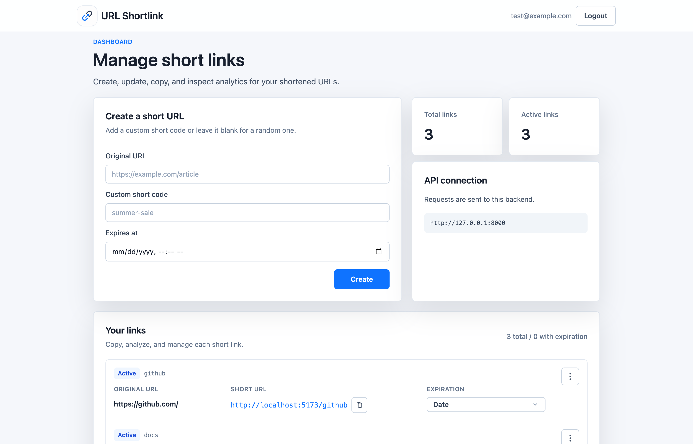
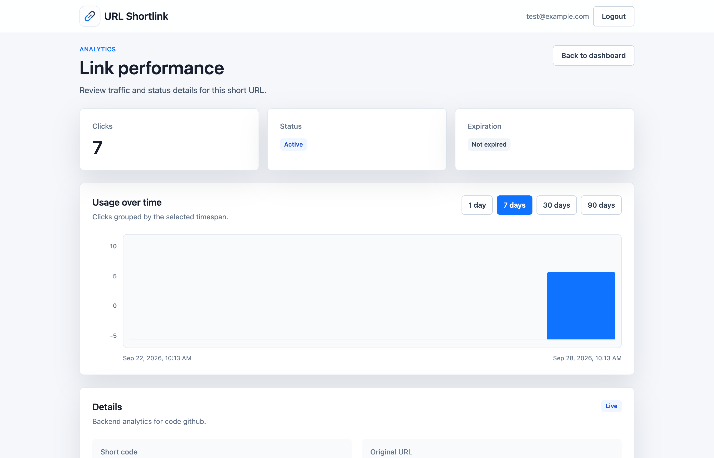
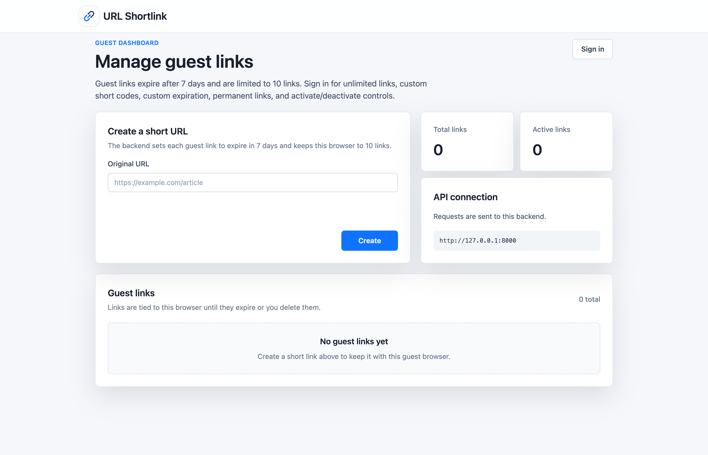

# URL Shortlink

A full-stack URL shortener with click analytics. Paste a long link, get a short one, and see how many times it's been clicked.



## Features

- Shorten links as a guest (up to 10, expire after 7 days) or with an account (unlimited)
- Custom short codes, e.g. `/github`
- Optional expiration dates
- Turn links on or off, or delete them
- Click analytics with a usage chart



## Tech

**Frontend:** React, TypeScript, Vite, Tailwind CSS
**Backend:** FastAPI, SQLAlchemy, PostgreSQL, Alembic, JWT auth
**Infra:** Docker Compose

## Running locally

You need Docker.

```bash
docker compose up --build
```

- App: http://localhost:5173
- API docs: http://localhost:8000/docs

To stop it, run `docker compose down`. Add `-v` to also wipe the database.

## Tests

```bash
pip install -r requirements.txt
python -m pytest -q
```


